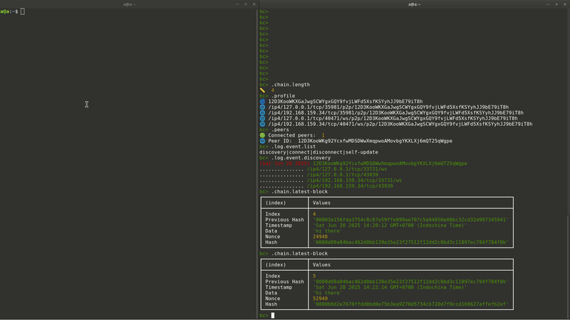

# Blockchain CLI

Simple Blockchain Command Line Interface



## 📝 Features

- ⩩ SHA256
- 📦 Block: Index, Previous Hash, Timestamp, Data, Nonce, Hash
- ⛓️🧱 In memory array to store blockchain
- ⛏️ Proof Of Work
- 💻↔️💻 Local Peer to Peer Network
- 📜 Allow viewing event and protocol log entries
  > ⚠️ **Note:** Data in the block is of type `string`.

## 🚀 Installation

### ⚙️ **Requirements**

- Node.js ≥ v22
- NPM ≥ v11
- Git

---

### 📥 **Steps**

```bash
# 1. Clone the repository
git clone https://github.com/whisky81/blockchain-cli.git

# 2. Navigate into the project folder
cd blockchain-cli

# 3. Install dependencies
npm install

# 4. Build and run the app
npm run build
npm run dev
```

#### 🧪 CLI Testing (Unix-like systems)

```bash
# Link the CLI globally for local testing
npm run link-cli

# Now you can run the CLI directly
blockchain
```

### 🛠️ Built With

- [**libp2p**](https://libp2p.io/) – Peer-to-peer networking framework
- [**chalk**](https://github.com/chalk/chalk) – Terminal string styling
- [**node:readline/promises**](https://nodejs.org/api/readline.html) – Promise-based CLI input handling
- [**node:crypto**](https://nodejs.org/api/crypto.html) – Native cryptographic functionality
- node:fs/promises

## 🙏 Acknowledgements

> 📖 Part of the code and ideas were referenced from  
> [https://github.com/0xs34n/blockchain](https://github.com/0xs34n/blockchain)

### 🐘⚙️📄 Libp2p configuration object

```js
const config = {
  addresses: {
    listen: ["/ip4/0.0.0.0/tcp/0", "/ip4/0.0.0.0/tcp/0/ws"],
  },
  transports: [tcp(), webSockets()],
  streamMuxers: [yamux()],
  connectionEncrypters: [noise()],
  peerDiscovery: [mdns({ interval: 2000 })],
};
```
